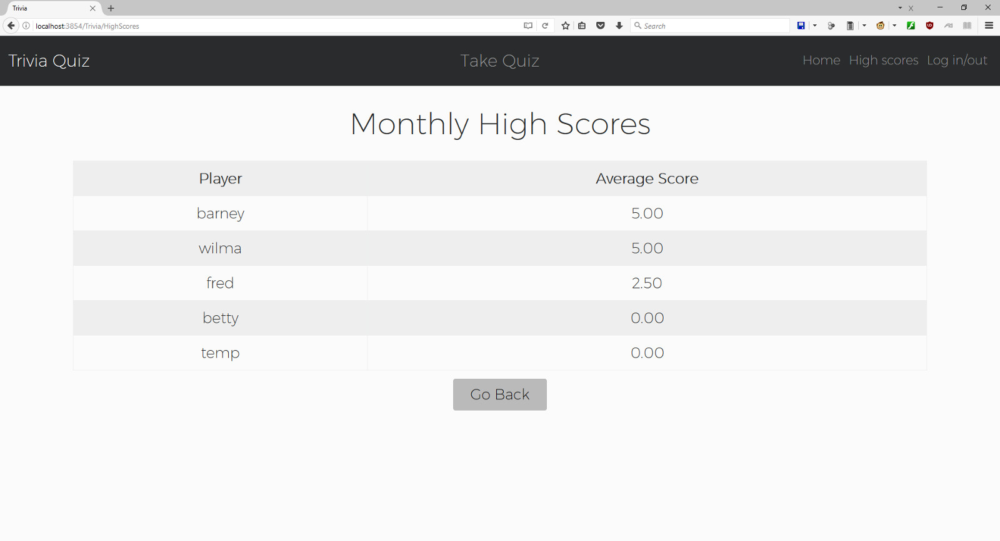
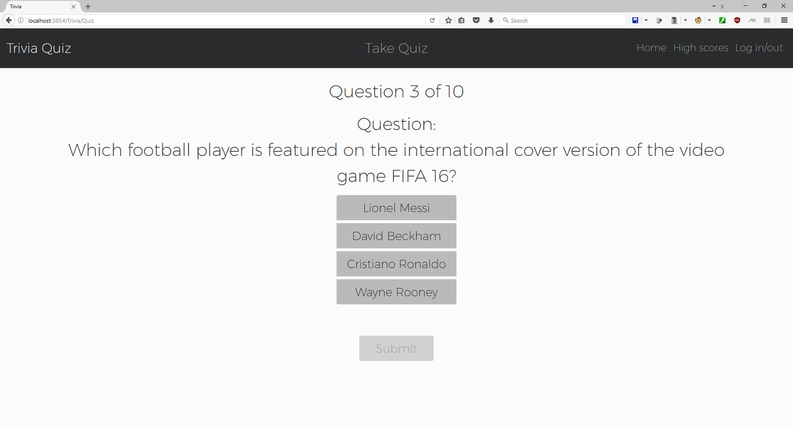

# TriviaQuiz

NOTE: Application is provided as code example only. Does not run as user database connection information has been removed for security. Source code is otherwise unchanged from original submission.

An ASP.NET MVC application that uses a web API (https://opentdb.com/api_config.php) to generate a 10-question trivia quiz.
Built for IN710 Object Oriented Systems Development, semester 1, 2017.

Additional features: Basic user database for high score tracking. Interface built in HTML/CSS with Bootstrap 3.

Screenshots:

Source folder:
https://github.com/kellybs1/TriviaQuiz/tree/master/kellybs1IN710Trivia/kellybs1IN710Trivia
